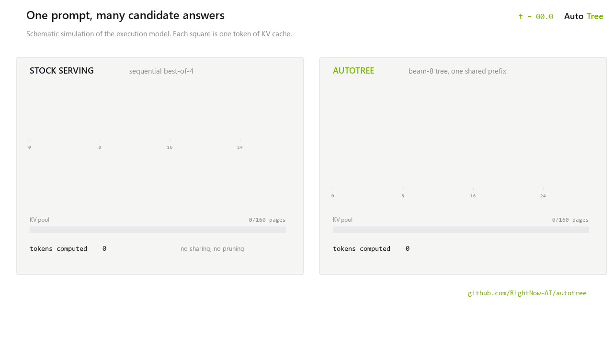

<p align="center">
  <picture>
    <source media="(prefers-color-scheme: dark)" srcset="assets/banner-dark-v3.svg">
    
  </picture>
</p>

<p align="center">
  <a href="https://github.com/RightNow-AI/autotree/actions/workflows/ci.yml"></a>
  <a href="LICENSE"></a>
  
  
</p>

AutoTree executes LLM reasoning as a tree. It shares prefix KV state across
branches, forks candidate continuations with copy-on-write pages, and lets a
Rust scheduler prune or continue them under a hard token budget. The API is
OpenAI-compatible: adopting it means changing one `base_url`.

<p align="center">
  <picture>
    <source media="(prefers-color-scheme: dark)" srcset="assets/mechanism-dark.gif">
    
  </picture>
</p>

## Measured results

Everything below was measured on rented cloud GPUs. Full evidence, configs,
and per-sample data ship in this repository.

| Measurement | Result | Evidence |
|---|---|---|
| Triton tree-attention kernel parity vs CPU reference (A100) | 106 tests pass | [`core/docs/a100-validation.md`](core/docs/a100-validation.md) |
| Qwen3-8B greedy parity vs stock HuggingFace, CUDA bf16 | holds | same |
| Kernel branch scaling, 32 branches at context 128 | 31.6x throughput | same |
| End-to-end KV reuse, beam-8 tree on real MATH-500 tasks (H100) | 8.79x | [`docs/first-benchmark.md`](docs/first-benchmark.md) |
| Beam-8 with logprob winner selection vs sequential best-of-4 | loses (21.3% vs 30.7% acc@1) | same |

The last row is deliberate. Naive tree search without a value scorer does not
beat independent sampling, and that measured baseline is what the pluggable
value-scorer interface exists to beat. Benchmark files carry schema-enforced
provenance: fixture data cannot claim to be a real result.

## Quickstart

Prerequisites: [uv](https://docs.astral.sh/uv/) and Rust 1.93 or newer.

```bash
uv venv --python 3.12
uvx maturin build --release --features python --manifest-path scheduler/Cargo.toml --out dist
uv pip install -e './core[engine]' -e ./serve dist/autotree_scheduler-*.whl
uv run --no-project autotree serve --engine treekv --model gpt2
```

Request a tree completion:

```bash
curl -s http://127.0.0.1:8000/v1/tree/completions \
  -H "Content-Type: application/json" \
  -d '{"model":"gpt2","messages":[{"role":"user","content":"Explain why shared prefixes matter."}],"max_tokens":4,"seed":7,"tree":{"policy":"beam","branches":3,"budget_tokens":12}}'
```

The response is a chat-completion object plus a `tree` summary: branch
outcomes, scores, token spend, and KV reuse. With the server running, open
`http://127.0.0.1:8000/playground` to watch branches fork and get pruned
live. The page is served offline by the server itself.

Windows commands and captured output: [docs/quickstart.md](docs/quickstart.md).

## GPU serving

Serve a real model on CUDA:

```bash
uv pip install --index-url https://download.pytorch.org/whl/cu128 "torch==2.11.0+cu128"
autotree serve --engine treekv --model Qwen/Qwen3-8B --device cuda --dtype bfloat16
```

Note on drivers: torch 2.12+ ships CUDA 13 wheels only. On CUDA 12.8 drivers,
pin `torch==2.11.0+cu128` as shown or CUDA is silently unavailable.

## Packages

| Path | Responsibility |
| --- | --- |
| `core/autotree_core/kv/` | Paged KV pool: copy-on-write forks, pruning, dedup, gathers, accounting |
| `core/autotree_core/kernels/` | PyTorch reference tree attention plus the Triton decode kernel |
| `core/autotree_core/engine/` | Model executor and TreeKV engine connecting weights, KV state, and scheduling |
| `scheduler/` | Rust beam, best-first, and MCTS policies with budget enforcement; PyO3 bindings |
| `serve/` | `autotree` CLI, OpenAI-style endpoints, SSE streaming, Prometheus metrics, playground |
| `sdk/` | Typed Python client and rollout-trace exports for RL pipelines |
| `thoughtbench/` | Benchmark harness with provenance-labeled fixture and real task sets |
| `figures/` | Publication figure pipeline; regenerates every chart from results JSON |
| `deploy/`, `grafana/` | Helm chart, plain manifests, SLURM templates, dashboard pack |

The normative Tree-KV contract is
[`core/docs/tree-kv-spec.md`](core/docs/tree-kv-spec.md). Component wiring is
in [docs/architecture.md](docs/architecture.md).

## Verification

Every suite runs from one script, including a gate that builds the Rust wheel
and tests the server against the real engine:

```bash
./scripts/verify-local.sh          # Linux and macOS
scripts/verify-local.ps1           # Windows PowerShell
```

Add `-Modeling` on PowerShell for the slower real-model suites. GPU suites
activate automatically on a CUDA machine.

## Docker

`docker build -t autotree-cpu .` builds the scheduler wheel and produces a
non-root image that serves GPT-2 through TreeKV on port 8000.

## Status

Implemented and verified: the tree engine on CPU and single CUDA devices, the
serving surface, the benchmark harness, and the measurements listed above.
Not yet implemented: multi-GPU tensor parallelism, value-scorer-guided
pruning, production-rate decode throughput, and merge events emitted by the
engine loop. Limitations and API coverage: [docs/faq.md](docs/faq.md).

## License

Apache-2.0.
